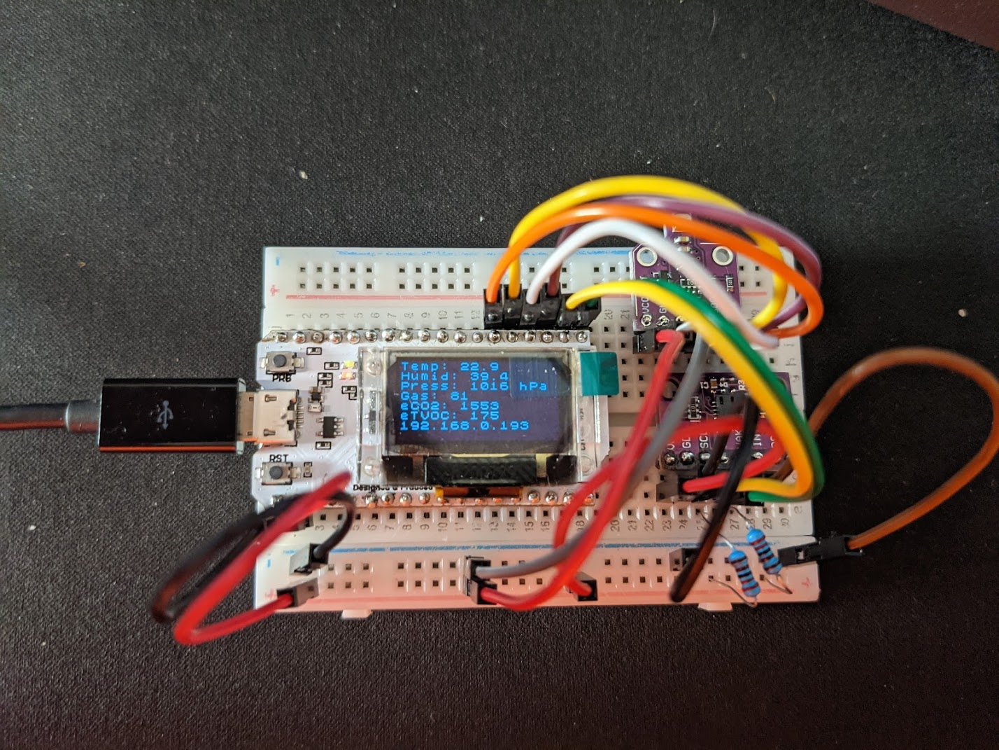
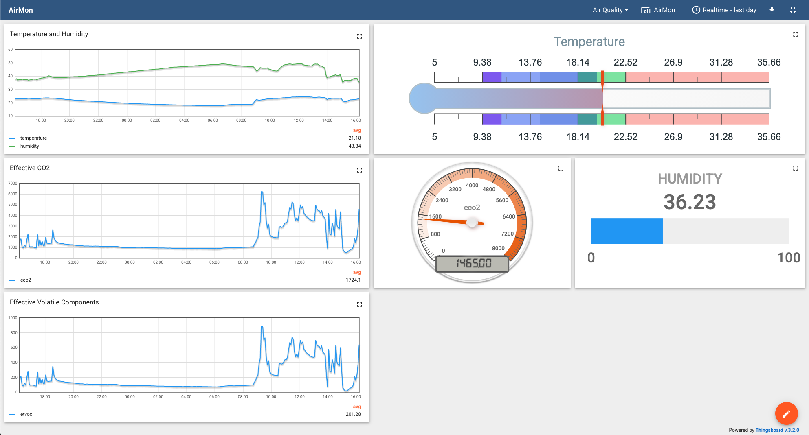
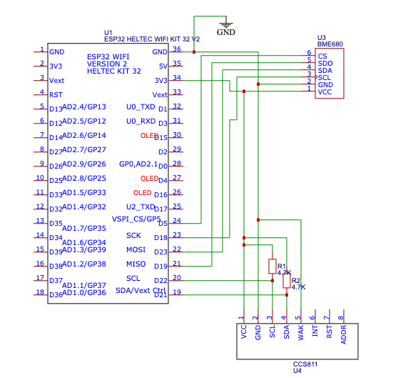

# AirMon

## Documentation tracker

What I am planning to document:
- [x] Write an overview with some photographs of what was done
- [x] Describe the electronic part of the project
- [x] Describe the client-side software part of the project
- [ ] Describe configuring ThingsBoard and wiring it together
- [ ] Write about all the interesting gotchas.

## Overview

It all really started with the lockdown. Wait, no, it all started even before
that - when we moved to our new house, we decided to build a home office in our
garden, which in the long run turned out to be one of the best decisions we've
ever made. We used it to work from home over evenings (because managing two full
time careers and kids is tough, d'oh).

Then lockdown happened and we started working from our office full time - again,
building it was the best decision we made in a long time (as we've made a number
of poor ones too in comparison). When it was warm and we kept windows open
everything was just fine, but problems started to arise as winter hit (with
temperature hitting negative Celsius every now and again) and doors and windows
becoming permanently closed - the little building (something like 5x3.5) just
didn't have enough of oxygen to support two people working full time (with a
bunch of computers running just as well).

I mean, opening windows every now and again and going out would be easy, but we
are not looking for easy ways, right? One cannot improve what one cannot
measure, so I started this project.



When everything is wired together and working, here's what I see in ThingsBoard:



## Electronics

The whole setup consists of just a few components:

1. ESP32 MCU - I've used [Heltec WiFi Kit
   32](https://heltec.org/project/wifi-kit-32/) purely because this was the one
   I had handy - and the fact that it comes with a built-in LCD which is handy
   for quick debugging.
2. [CCS811](https://www.sciosense.com/products/environmental-sensors/ccs811-gas-sensor-solution/)
   sensor - I've used [CJMCU-811](https://revspace.nl/CJMCU-811) variation of
   it, because they are  few dimes a dozen on Aliexpress. There's more expensive
   variant from Adafruit, but it was out of stock at the moment. Admittedly this
   is not the best CO2 sensor, but you get what you pay for - this sensors
   measures eCO2 or Effective CO2, i.e. it doesn't measure CO2 directly but
   instead measures other gas characteristics highly correlated with CO2. True
   Co2 sensors are generally far more expensive, in the order of £60+.
3. [Bosch
   BME680](https://www.bosch-sensortec.com/products/environmental-sensors/gas-sensors-bme680/)
   --  great little sensor that provides temperature, humidity and air pressure,
   something that is not supported in CCS811.
4. 2x4.7 KOhm resistors used as pull-ups for I2C lines of the ESP32.
   
Here's the entire circuit:



Note the use of pull-ups: it took me a long time to understand why on this
specific ESP32 I2C refuses to find the device without pullups, whereas on others
(most notably WROOM32-based boards) everything just works. Turns out, ESP32 has
only very weak pull-ups according to the standard, and one should always use
them, no matter what. 

## Software

For the software part I had a number of options:
- I could use [Espressif
  toolkit](https://www.espressif.com/en/products/software/esp-sdk/overview)
  which is a cross-compiler toolchain based on GCC. This means I could use
  regular CMake toolkit and any C++ IDE capable of supporting cross-compiler
  would work (VSCode/Clion etc).
- Easier alternative would've been using Arduino IDE with ESP32 board definition
  -- this way I am using well-known and familiar Arduino framework
  (`setup()`/`loop()`/`digitalWrite(...)` and so on). I really liked that
  option because of simplicity and ridiculous amount of libraries available,
  but I really disliked Arduino IDE.

Then I learned about [PlatformIO](https://platformio.org/). PlatformIO is, in my
opinion, an astonishing framework that allows one to write code using their
toolkit, which integrates nicely into VSCode or CLion, for any board they
support, using either native framework for that board (esp-idf for ESP32) or,
you guessed it right, Arduino framework. This was a no brainer.

Specifically, for this project it means that once you have PlatformIO installed
and configured you simply do:

```
$ . ~/.platformio/penv/bin/activate
(penv) $ pio run 
```

And it automatically downloads the correct toolchain for the board you are
compiling for, downloads all the libraries it needs, and finally compiles and
links your final `elf` file. Cool, isn't it?

You would _probably_ want to familiarise yourself first with PlatformIO - start [here](https://docs.platformio.org/en/latest/what-is-platformio.html).